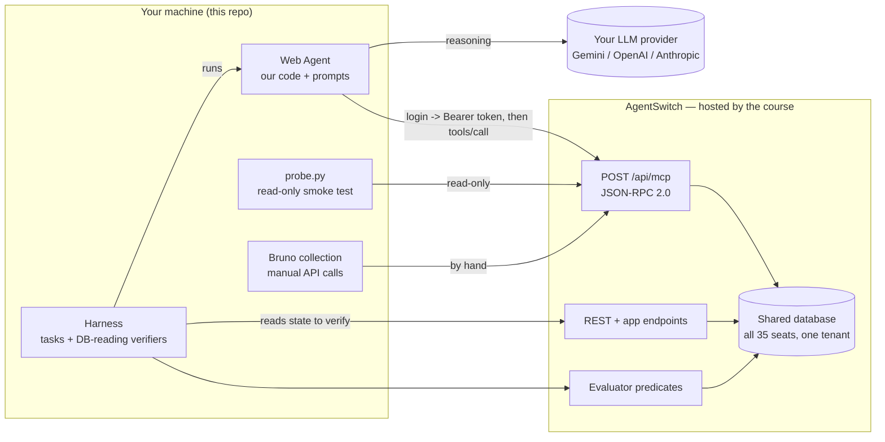

# AgentSwitch Web Agent

An autonomous agent for the **Website seat** of [AgentSwitch](https://agentswitch.theschoolofai.in),
built for the **EAG V3** capstone (The School of AI). The agent drives a live, multi-tenant
business platform over **MCP** to do real work, and ships with its own **harness** that proves
the work happened by reading the database, not by trusting the agent's words.

> **Team A9 · Seat 09 · "RA9 Web Agent: Publishing and Page Analytics"**

---

## The one job

The platform judges our agent on a single seat-specific request:

> **"Publish a post about the new fixture line, and tell me which pages nobody reads."**

Two evaluator goals back it: **`web.publish_post`** and **`web.pages_without_traffic`**.
Grading reads **database state after the agent runs** — a reply that sounds right but writes the
wrong row fails. Several steps, a judgement call, and a state change (publishing) in the middle.

---

## How the pieces connect



Full diagrams (auth flow + the graded-task data flow) are in
[`docs/ARCHITECTURE.md`](docs/ARCHITECTURE.md).

---

## Repository layout

```
agentswitch-web-agent/
├── README.md                     # you are here
├── docs/
│   ├── SETUP.md                  # dot-by-dot of everything we set up locally
│   ├── ARCHITECTURE.md           # the graph: components, auth flow, data flow
│   └── PLAN.md                   # the four-week plan, week by week
├── notes/
│   └── website-capabilities.md   # live capability map (236 tools, our 36, the gaps)
├── bruno/                        # git-friendly API client collection (.bru files)
│   ├── bruno.json
│   ├── environments/             # Suryodaya (India) + Keystone (US)
│   └── *.bru                     # login, auth-me, MCP handshake, tools/call examples
├── probe.py                      # zero-dep read-only connection test + capability dump
├── .env.example                  # copy to .env (git-ignored) and fill locally
└── .gitignore
# to come: agent/ (the loop) and harness/ (tasks + verifiers)
```

---

## Quickstart

```bash
# 1. Config (secrets stay local — .env is git-ignored)
cp .env.example .env          # then paste your team password into AS_PASSWORD=

# 2. Prove the connection (read-only; never prints your token)
set -a; source .env; set +a
python3 probe.py

# 3. Poke it by hand: open the bruno/ folder in Bruno, pick the Suryodaya
#    environment, set the `password` secret, run "01 Login", then anything else.
```

See [`docs/SETUP.md`](docs/SETUP.md) for the full walk-through.

---

## What we build vs. what already exists

| Already built by the course (we do NOT build it) | We build |
|---|---|
| The platform: 424 entity types, CRUD, auth, approval engine, audit trail, job runner, UI | The **agent** for our seat |
| The MCP + REST interfaces over all of it | The **harness**: tasks + verifiers that read the DB |
| The shared database and the evaluator predicates | Our own prompts, tools, planning, model choice |

Effort split to remember: the **agent is the smaller, known part** (a perceive -> decide -> act
loop); the **harness is the bigger, graded part** that most teams underbuild.

---

## Security

- **No credentials live in this repo, ever.** Passwords and tokens are per-team secrets.
- `.env` (shell) and Bruno secret variables are git-ignored / stored outside the repo.
- Every write to the platform is attributed to whoever is signed in, so the login is guarded
  like a key.
