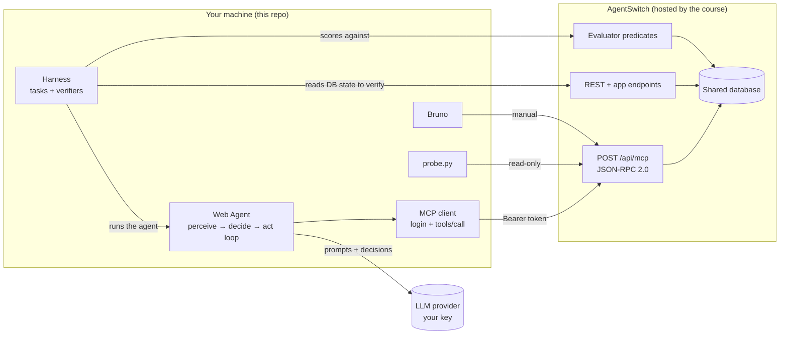
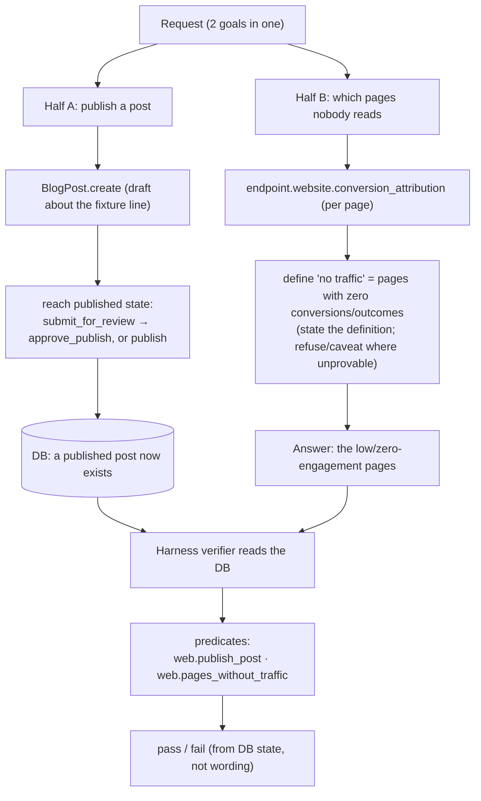
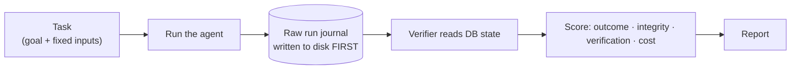

# Architecture — the graph, with code and data flow

Three views: **who talks to whom** (components), **how we authenticate** (auth flow), and
**how the graded task moves through the system** (data flow). Then the harness loop that scores it.

---

## 1. Components — who talks to whom



**Nodes**

- **Web Agent** — our code. One loop: read state → decide the next step → call a tool → repeat
  until the goal is met. Runs on our machine with our model key.
- **MCP client** — the thin layer that logs in, holds the Bearer token, and makes `tools/call`
  requests. This is the agent's only door to the platform.
- **Harness** — our test rig. Runs the agent on a task set and, crucially, **verifies by reading
  the database**, not by reading the agent's reply. Saves every run to disk before scoring.
- **probe.py / Bruno** — exploration tools. Not part of the running agent; they help us learn
  and debug the API by hand.
- **AgentSwitch (hosted)** — the platform. Same database and permission rules behind MCP, REST,
  and the web UI. The **evaluator predicates** decide, from the DB alone, whether a goal passed.

---

## 2. Auth flow

```mermaid
sequenceDiagram
  participant C as Agent / probe.py / Bruno
  participant S as AgentSwitch
  C->>S: POST /api/auth/login  { email, password }
  S-->>C: { token }   (the Bearer token)
  C->>S: POST /api/mcp  Authorization: Bearer &lt;token&gt;
  S-->>C: JSON-RPC result
  Note over C,S: A JSON-RPC error still returns HTTP 200 — check the envelope, not just the status.
  Note over C,S: The web UI is different: cookie + X-CSRF-Token header (we don't use that path).
```

The password only ever appears in the login call, sourced from a git-ignored place (`.env` or
a Bruno secret). The token is short-lived and never written to disk.

---

## 3. The graded task, as data flow

Request: **"Publish a post about the new fixture line, and tell me which pages nobody reads."**



The key design fact lives in Half B: the platform has **no raw page-view counter**, only
conversion data. So "traffic" has to be *defined* by us and defended — and the case where it
cannot be answered truthfully is our built-in **refusal** task.

---

## 4. The harness loop (where the points are)



Rules the harness enforces (straight from the grading spec):

- **Verify from the database, never from the agent's prose.**
- **Write the raw run to disk before scoring** — so any score can be recomputed later without
  re-running the model.
- **At least one task whose correct answer is a refusal.**
- **Tests are hand-written** (a test written by Claude/Codex scores zero); 10 points each, plus
  100 points for every new reproducible platform bug.

---

## 5. Code flow (planned module shape)

```
agent/
  mcp_client.py     # login(), call(name, args); holds the Bearer token
  perception.py     # read the slice of state a task needs (Webpage.list, conversion_attribution, ...)
  decision.py       # LLM plans the next step against the goal
  action.py         # execute a tools/call, then re-read (state moves underneath us)
  loop.py           # perceive → decide → act until the predicate is satisfiable
harness/
  tasks/            # one file per task: goal, inputs, the verifier
  verifiers.py      # read DB via the API, return pass/fail + evidence
  run.py            # run a task, journal to disk, then score
  runs/             # git-ignored raw journals
```

This mirrors the 4-layer pipeline the course already taught (Perception → Memory → Decision →
Action); we reuse that shape rather than invent a new one.
